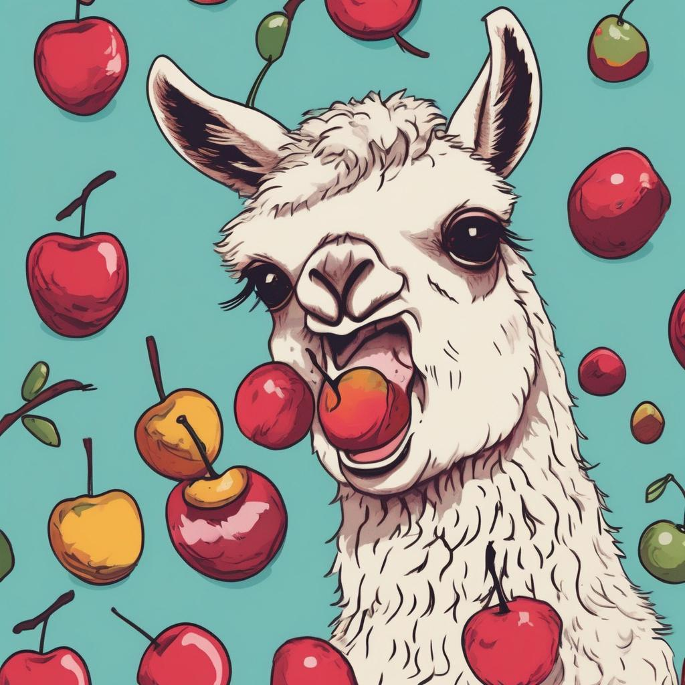
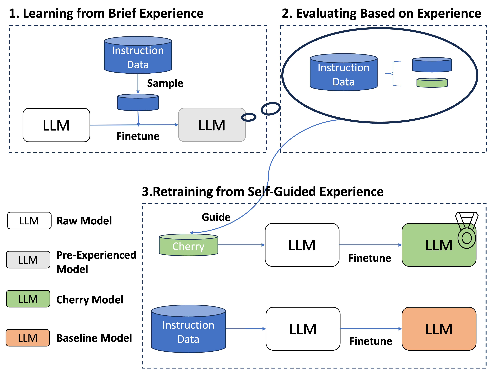
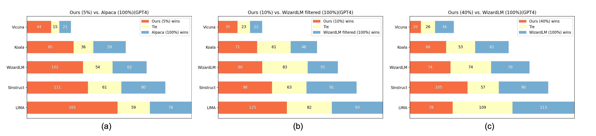

# From Quantity to Quality: Boosting LLM Performance with Self-Guided Data Selection for Instruction Tuning (NAACL'24)


[From Quantity to Quality: Boosting LLM Performance with Self-Guided Data Selection for Instruction Tuning](https://arxiv.org/abs/2308.12032)<br>(NAACL'24)

<p align="center" width="40%">
<a ></a>
</p>


This is the repo for the Cherry Data Selection project, which introduces a self-guided methodology for LLMs to autonomously discern and select cherry samples from vast open-source datasets, effectively minimizing manual curation and potential cost for instruction tuning an LLM.

The repo contains:

- The cherry data used for fine-tuning the model, cherry_data_v1 represents the cherry data obtained based on the llama-1 model. 
- The model checkpoints that were trained using our cherry data.
- The code for selecting cherry data from the existing instruction-tuning dataset.

(Feel free to email minglii@umd.edu for any questions or feedback.)

## News
- [2024/03] Our paper has been accepted to the **NAACL 2024** main conference! 
- [2024/02] We released the [Superfiltering](https://github.com/tianyi-lab/Superfiltering), which reveals the strong consistency between small and large LLMs in perceiving and evaluating the difficulty of instruction tuning data and utilizes a small LM, e.g., GPT-2 (124M), to effectively and efficiently select data for instruction tuning.
- [2023/12] An updated code for calculating the statistics for IFD scores, please check [Reflection-Tuning Code for Selection](https://github.com/tianyi-lab/Reflection_Tuning?tab=readme-ov-file#code-for-selection).
- [2023/12] The statistics necessary for calculating IFD scores on Alpaca and WizardLM on llama2-7b and llama2-13b were released, please check: [Alpaca llama2 7b](https://huggingface.co/datasets/MingLiiii/Alpaca_Analysis_llama2_7b), [Alpaca llama2 13b](https://huggingface.co/datasets/MingLiiii/Alpaca_Analysis_llama2_13b), [WizardLM70k llama2 7b](https://huggingface.co/datasets/MingLiiii/Wiz70_Analysis_llama2_7b), [WizardLM70k llama2 13b](https://huggingface.co/datasets/MingLiiii/Wiz70_Analysis_llama2_13b).
- [2023/11] We added some results on llama2-7b and llama2-13b, further showing the generalizability of our method.  
- [2023/09] We partially reconstructed the repo structure and added some results on llama2.  
- [2023/09] We released codes for evaluating the performance between two LLMs by using GPT4 or chatGPT. 
- [2023/09] We released codes for this project.

## Contents
- [Overview](#overview)
- [Highlights](#highlights)
- [Install](#install)
- [Run Code](#run-code)
- [Data and Model Weights V1](#data-and-model-weights-v1)
- [Data and Model Weights V2](#data-and-model-weights-v2)
- [Evaluation](#evaluation)
- [Performance Comparison ](#performance-comparison)
- [Prompt](#prompt)
- [Hyperparameters](#hyperparameters)
- [ToDo](#todo)
- [Citation](#citation)

## Overview

Our study puts forth a method for autonomously sifting through expansive open-source datasets to discover the most impactful training samples. We coin these samples as "cherry data", designating those data fragments that hold the potential to exponentially enhance LLM instruction tuning. At the heart of our research is the hypothesis that during their preliminary training stages with carefully chosen instruction data, LLMs can develop an intrinsic capability to discern instructions. This foundational understanding equips them with the discernment to assess the quality of broader datasets thus making it possible to estimate the instruction-following difficulty in a self-guided manner. 

<p align="center" width="70%">
<a ></a>
</p>

Initially, the model is familiarized with a fraction of the target dataset during the "Learning from Brief Experience" phase. This preliminary knowledge paves the way for the subsequent "Evaluating Based on Experience" phase, where we meticulously evaluate the model's response generation. To estimate the difficulty of a given example, we propose a novel metric called Instruction-Following Difficulty (IFD) score in which both models' capability to generate a response to a given instruction and the models' capability to generate a response directly are measured and compared. By calculating Instruction-Following Difficulty (IFD) scores, we quantify the challenge each sample presents to the model. Harnessing these insights, the "Retraining from Self-Guided Experience" phase utilizes cherry data with standout IFD scores to hone the model, culminating in our superior cherry models. The net result is a model that aligns more adeptly with instructions, ensuring enhanced performance.

## Highlights

* The selection of cherry data in this project is entirely self-guided and does not need ANY extra outside models, ranging from BERT to chatGPT.
* We use approximately 5% or 10% of the data to have comparable performances to the models trained on full data, which is experimented on the [Alpaca](https://github.com/tatsu-lab/stanford_alpaca) and [WizardLM](https://github.com/nlpxucan/WizardLM) datasets.
* The IFD score proposed by us can divide the samples into better or relatively bad ones, which might provide insight into the types of data good for instruction tuning.
* **(Selective Reflection-Tuning)** The IFD scores and the reversed version can be utilized to construct better data! In [Reflection-Tuning Code for Selection](https://github.com/tianyi-lab/Reflection_Tuning?tab=readme-ov-file#code-for-selection), we proposed the Teacher-Student Collaboration pipeline to construct a training set customized for the student. 
* **(Superfiltering)** The IFD scores calculated by LLMs with different sizes share strong consistencies! Thus you can utilize a really small language model like GPT2 to select the data for instruction tuning, which would be super fast and efficient! Please see [Superfiltering](https://github.com/tianyi-lab/Superfiltering) for details. 

## Install

Install the dependencies with `pip install -r requirements.txt`

Note: This `requirements.txt` is originated from the [Stanford Alpaca](https://github.com/tatsu-lab/stanford_alpaca). If you are using a different code base with PyTorch installed, we recommend you manually install the below packages and do not need to install from `requirements.txt`

`pip install tqdm`

`pip install scikit-learn`

## Run Code


1. Select Pre-Experienced Data

```
python cherry_seletion/data_analysis.py \
    --data_path data/alpaca_data.json \
    --save_path alpaca_data_pre.pt \
    --model_name_or_path <your_path_to_hf_converted_llama_ckpt_and_tokenizer> \
    --max_length 512 \
    --prompt alpaca \
    --mod pre
```

```--data_path```: The targeted dataset in the Alpaca format <br>
```--save_path```: The path to save the ```.pt``` file containing embeddings or scores <br>
```--prompt```: The prompt type used for training and selecting data, can choose between ```alpaca``` or ```wiz``` <br>
```--mod```: ```pre``` used for getting needed embeddings or scores on selecting pre-experienced samples and ```cherry``` used for cherry <br>

```
python cherry_seletion/data_by_cluster.py \
    --pt_data_path alpaca_data_pre.pt \
    --json_data_path data/alpaca_data.json \
    --json_save_path alpaca_data_pre.json \
    --sample_num 10 \
    --kmeans_num_clusters 100 \
    --low_th 25 \
    --up_th 75
```

```--pt_data_path```: The ```.pt``` file from previous step containing needed embeddings or scores
```--json_data_path```: The targeted dataset in the Alpaca format <br>
```--json_save_path```: The path to save the selected pre-experienced samples <br>
```--sample_num```: How many samples will be selected in each cluster <br>
```--kmeans_num_clusters```: How many clusters will be generated by K-Means <br>
```--low_th``` and ```--up_th```: The lower and Upper threshold for selecting samples within each cluster <br>


3. Train Pre-Experienced Model

4. Select Cherry Data

```
python cherry_seletion/data_analysis.py \
    --data_path data/alpaca_data.json \
    --save_path alpaca_data_cherry.pt \
    --model_name_or_path <your_path_pre_experienced_model> \
    --max_length 512 \
    --prompt alpaca \
    --mod cherry
```

```
python cherry_seletion/data_by_IFD.py \
    --pt_data_path alpaca_data_cherry.pt \
    --json_data_path data/alpaca_data.json \
    --json_save_path alpaca_data_cherry.json \
    --max_length 512 \
    --sample_rate 0.06 \
    --prompt alpaca
```

```--sample_rate```: How many cherry samples you would like to select? You can also use ```--sample_number``` to set the exact number of samples. 

6. Train Cherry Model

## Data and Model Weights V1

### llama 1 models

The following table provides a comparison between our cherry models and baseline models on the Huggingface Open LLM Leaderboard and AlpacaEval Leaderboard. <br>
These results are based on cherry_data_v1. The prompt and training hyperparameters can be found in the Hyperparameters section. 
These results verify the effectiveness of our method, which can be used to select the most valuable data samples for instruction tuning. <br>


|                          | **Avg** | **ARC** | **HellaSwag** | **MMLU** | **TruthfulQA** || **AlpacaEval** ||**Data**| **Model**|
|--------------------------|:-----------:|:-------:|:-------------:|:-------:|:--------------:|:-:|:--------------:|:-:|:-:|:-:|
| **Alpaca**      | 50.21       | 42.65   | 76.91         | 41.73   | 39.55          || 26.46          ||/|/|
| **5% Alpaca**     | 52.06| 53.92   | 79.49         | 36.51   | 38.33          || 34.74          ||[[Link]](cherry_data_v1/cherrt_alpaca/cherry_alpaca_5_percent.json)|[[hf-Link]](https://huggingface.co/MingLiiii/cherry-alpaca-5-percent-7B)|
| **10% Alpaca**     | /       | /   | /         | /   | /          || /          ||[[Link]](cherry_data_v1/cherrt_alpaca/cherry_alpaca_10_percent.json)|[[hf-Link]](https://huggingface.co/MingLiiii/cherry-alpaca-10-percent-7B)|
| **15% Alpaca**     | /       | /   | /         | /   | /          || /          ||[[Link]](cherry_data_v1/cherrt_alpaca/cherry_alpaca_15_percent.json)|[[hf-Link]](https://huggingface.co/MingLiiii/cherry-alpaca-15-percent-7B)|
||||||||||||
| **WizardLM**    | 54.18       | 51.60   | 77.70         | 42.70   | 44.70          || 67.64          ||/|/|
| **WizardLM*** | 52.79  | 53.07   | 77.44         | 37.75   | 42.90          || 61.99          ||[[hf-Link]](https://huggingface.co/datasets/MingLiiii/cherry_wizardlm_filtered)|[[hf-Link]](https://huggingface.co/MingLiiii/cherry-wizardlm-filtered-7B)|
| **10% WizardLM**  | 51.59       | 52.90   | 78.95         | 33.08   | 41.41         || 61.44          ||[[Link]](cherry_data_v1/cherry_wizardLM/cherry_wizardLM_10_percent.json)|[[hf-Link]](https://huggingface.co/MingLiiii/cherry-wizardlm-10-percent-7B)|
| **20% WizardLM**     | /       | /   | /         | /   | /          || /          ||[[Link]](cherry_data_v1/cherry_wizardLM/cherry_wizardLM_20_percent.json)|[[hf-Link]](https://huggingface.co/MingLiiii/cherry-wizardlm-20-percent-7B)|
| **20% WizardLM**     | /       | /   | /         | /   | /          || /          ||[[Link]](cherry_data_v1/cherry_wizardLM/cherry_wizardLM_30_percent.json)|[[hf-Link]](https://huggingface.co/MingLiiii/cherry-wizardlm-30-percent-7B)|
| **40% WizardLM**  | 52.83       | 53.07   | 77.79         | 35.29   | 45.17          || 65.09          ||[[Link]](cherry_data_v1/cherry_wizardLM/cherry_wizardLM_40_percent.json)|[[hf-Link]](https://huggingface.co/MingLiiii/cherry-wizardlm-40-percent-7B)|
||||||||||

Also, the WizardLM filter script is provided here: [[Link]](cherry_seletion/filter.py)

### llama 2 models 

Thanks to the [FastChat](https://github.com/lm-sys/FastChat) and [flash-attention](https://github.com/Dao-AILab/flash-attention), we are able to run our experiments with longer length. <br>
The above results are directly using cherry_data_v1 for finetuning the llama-2-7B model, with the length of 2048, and using original vicuna prompts. 

|                          | **Avg** | **ARC** | **HellaSwag** | **MMLU** | **TruthfulQA** || **AlpacaEval** ||**Data**| **Model**|
|--------------------------|:-----------:|:-------:|:-------------:|:-------:|:--------------:|:-:|:--------------:|:-:|:-:|:-:|
| **WizardLM**    | 57.09       | 54.18   | 79.25         | 46.92   | 48.01          || 66.08          ||/|[Link]|
| **10% WizardLM**  | 57.57       | 54.86   | 80.46         | 45.74   | 49.20         || 71.36          ||[[Link]](cherry_data_v1/cherry_wizardLM/cherry_wizardLM_10_percent.json)|[Link]|
| **20% WizardLM**     | /       | /   | /         | /   | /          || /          ||[[Link]](cherry_data_v1/cherry_wizardLM/cherry_wizardLM_20_percent.json)|[Link]|
| **20% WizardLM**     | 58.50       | 55.97   | 80.40         | 46.87   | 50.76          || 72.57          ||[[Link]](cherry_data_v1/cherry_wizardLM/cherry_wizardLM_30_percent.json)|[Link]|
| **40% WizardLM**  | 58.00       | 56.23   | 80.22         | 46.15   | 49.37          || 70.52          ||[[Link]](cherry_data_v1/cherry_wizardLM/cherry_wizardLM_40_percent.json)|[Link]|
||||||||||

Note: WizardLM in the above table is our implementation using [FastChat](https://github.com/lm-sys/FastChat) code, prompt, and configuration. <br>
Note: Due to the hardware limit, all our models are using the 7B model. <br>
Note: For these llama2 models, we still use the cherry_data_v1 to ensure the effectiveness of our data. We will soon make the cherry_data_v2 which is based on llama2 available. 

## Data and Model Weights V2

In this section, all the IFD scores are calculated on llama2-7b or llama2-13b models by using Vicuna's prompt. The training of pre-experienced models is discarded for more efficient usage. The performances are promising in the llama2 model even without a pre-experienced model, indicating the proficiency of our proposed IFD scores. 

|                          | **Avg** | **ARC** | **HellaSwag** | **MMLU** | **TruthfulQA** || **AlpacaEval** ||**Data**| **Model**|
|--------------------------|:-----------:|:-------:|:-------------:|:-------:|:--------------:|:-:|:--------------:|:-:|:-:|:-:|
| **Alpaca-7b (llama2)**      | 55.25       | 54.35   |    78.65      |  47.02   |    40.98      ||    27.75       ||/|/|
| **5% Alpaca-7b (llama2)**     | 55.78| 57.94   | 80.37         | 44.91   | 40.62          || 36.78          ||/|/|
| **10% Alpaca-7b (llama2)**     | 56.31       | 58.02   | 80.42         | 46.64   | 40.18          || /          ||/|/|
| **15% Alpaca-7b (llama2)**     | 56.37       | 57.42   | 80.68         | 46.40   | 40.95         || /          ||/|/|
||||||||||||
| **Alpaca-13b (llama2)**      | 58.78       | 57.59   |    81.98      |  54.05   |    41.49      ||    35.00       ||/|/|
| **5% Alpaca-13b (llama2)**     | 61.21| 62.37   | 84.00         | 55.65   | 42.82          || 46.82          ||/|/|
| **10% Alpaca-13b (llama2)**     | 61.02       | 62.97   | 83.88         | 55.29   | 41.93          || /          ||/|/|
| **15% Alpaca-13b (llama2)**     | 61.23       | 62.37   | 83.48         | 55.56   | 43.42         || /          ||/|/|

All the above models are trained using [FastChat](https://github.com/lm-sys/FastChat) code and prompt. <br>
Data with IFD scores will be released soon. 

## Evaluation

We release the codes and data for using GPT4 or chatGPT to evaluate and compare the performance between two LLMs. This method greatly eliminates the potential position bias of GPT4 and chatGPT. For details, please see [AlpaGasus](https://github.com/Lichang-Chen/AlpaGasus) or our [paper](https://arxiv.org/abs/2308.12032). We thank [@Lichang-Chen](https://github.com/Lichang-Chen) and [AlpaGasus](https://github.com/Lichang-Chen/AlpaGasus) repo for sharing the evaluation codes.  

To use this code, please follow the below scripts:

```bash scripts/do_eval_generation.sh```: The model automatically generates the responses for a given instruction in test datasets. <br>
```bash scripts/do_eval_generation_wrap.sh```: Wrap the response files of LLMs being compared. <br>
```bash scripts/do_eval.sh```: Use GPT4 or chatGPT for the evaluation. <br>
```bash scripts/do_review_eval_score.sh```: Parse the results and draw the figure. <be>

More detailed illustrations will be updated. Feel free to drop me an email if you are urgent about it. 

## Performance Comparison 

Comparing our models trained on selected data with models trained on full data. (a) Comparison between our model with 5% Alpaca data and the official Alpaca model. (b) Comparison between our model with 10% WizardLM data and the reimplemented WizardLM model. (c) Comparison between our model with 40% WizardLM data and the official WizardLM model. All these experiments use GPT4 as the judge. Each horizontal bar represents a comparison in a specific test set. 

<p align="center" width="100%">
<a ></a>
</p>


## Prompt

We used the following prompts for fine-tuning the cherry models with Alpaca data:

- for examples with a non-empty input field:

 ```
 Below is an instruction that describes a task, paired with an input that provides further context. Write a response that appropriately completes the request.
 
 ### Instruction:
 {instruction}
 
 ### Input:
 {input}
 
 ### Response:
 ```

- for examples with an empty input field:

 ```
 Below is an instruction that describes a task. Write a response that appropriately completes the request.
 
 ### Instruction:
 {instruction}
 
 ### Response:
 ```

We used the following prompts for fine-tuning the cherry models with Wizard data:

```
{instruction}

### Response:
```


## Hyperparameters

| Hyperparameter | Global Batch Size | Learning rate | Epochs | Max length | Weight decay | Warmup Rate |
| --- | ---: | ---: | ---: | ---: | ---: | ---: |
| Cherry Models V1 (Alpaca) | 128 | 2e-5 | 3 | 512 | 0 | 0.03 |
| Cherry Models V1 (WizardLM) | 128 | 2e-5 | 3 | 1024 | 0 | 0.03 |
| --- | ---: | ---: | ---: | ---: | ---: | ---: |
| Cherry Models V2 7B | 128 | 2e-5 | 3 | 2048 | 0 | 0.03 |
| Cherry Models V2 13B | 128 | 1e-5 | 5 | 2048 | 0 | 0.03 |

## ToDo
- [x] Release the code, data, and models. 
- [x] Release the evaluation code for comparison.
- [x] Train Cherry WizardLM with the length of 2048.
- [x] Implement our method on llama 2 models. 
- [x] Modify the paper

## Citation

Please consider citing our paper if you think our codes, data, or models are useful. Thank you!
```
@inproceedings{li-etal-2024-quantity,
    title = "From Quantity to Quality: Boosting {LLM} Performance with Self-Guided Data Selection for Instruction Tuning",
    author = "Li, Ming  and
      Zhang, Yong  and
      Li, Zhitao  and
      Chen, Jiuhai  and
      Chen, Lichang  and
      Cheng, Ning  and
      Wang, Jianzong  and
      Zhou, Tianyi  and
      Xiao, Jing",
    editor = "Duh, Kevin  and
      Gomez, Helena  and
      Bethard, Steven",
    booktitle = "Proceedings of the 2024 Conference of the North American Chapter of the Association for Computational Linguistics: Human Language Technologies (Volume 1: Long Papers)",
    month = jun,
    year = "2024",
    address = "Mexico City, Mexico",
    publisher = "Association for Computational Linguistics",
    url = "https://aclanthology.org/2024.naacl-long.421",
    pages = "7595--7628",
}

@article{Li2024SuperfilteringWD,
  title={Superfiltering: Weak-to-Strong Data Filtering for Fast Instruction-Tuning},
  author={Ming Li and Yong Zhang and Shwai He and Zhitao Li and Hongyu Zhao and Jianzong Wang and Ning Cheng and Tianyi Zhou},
  journal={ArXiv},
  year={2024},
  volume={abs/2402.00530},
  url={https://api.semanticscholar.org/CorpusID:267365346}
}

@article{Li2024SelectiveRS,
  title={Selective Reflection-Tuning: Student-Selected Data Recycling for LLM Instruction-Tuning},
  author={Ming Li and Lichang Chen and Jiuhai Chen and Shwai He and Jiuxiang Gu and Tianyi Zhou},
  journal={ArXiv},
  year={2024},
  volume={abs/2402.10110},
  url={https://api.semanticscholar.org/CorpusID:267682220}
}

@inproceedings{li2023reflectiontuning,
  title={Reflection-Tuning: Recycling Data for Better Instruction-Tuning},
  author={Ming Li and Lichang Chen and Jiuhai Chen and Shwai He and Tianyi Zhou},
  booktitle={NeurIPS 2023 Workshop on Instruction Tuning and Instruction Following},
  year={2023},
  url={https://openreview.net/forum?id=xaqoZZqkPU}
}

```


